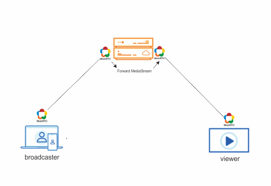

# WebRTCBroadCast
Simple streaming web application. you can streaming and watch as consumer. This Web App using <a href="https://webrtc.org">WebRTC</a> for media real-time communication, and <a href="https://socket.io">Socket.io</a> for signaling, also  SFU architecture which features the following data transmission processes between the media server and the endpoints (client).

- Features
  - Multiple Streaming
  - Watch a Streaming

- WebRTC (SFU architecture) 

- Clone this repo.
  - npm update

- Secure ip local
  - for custom ip local (server.js host) other than localhost, then you have set to your local ip (http) as (https). because WebRTC won't work if ip is not secure (http).
    to secure. open this link on your chrome
     - chrome://flags/#unsafely-treat-insecure-origin-as-secure
     - and paste your ip address 

- Config
  - set your host & port
     - host & port
        - server.js
        - index.js
        - viewer.js

- Start server
  - node server or nodemon server

- Run.
  - for broadcaster
    - http://ip:port
  - for viewers
    - http://ip:port/viewer.html

- Monitoring WebRTC Status on browser
    - chrome://webrtc-internals/

- Stunt Servers
    - "stun:stun.l.google.com:19302"
    - "stun:stun.stunprotocol.org"

# References
  
  - Code.
    - original code:
       - https://github.com/coding-with-chaim/webrtc-one-to-many

    - https://github.com/jamalag/flutter-webrtc-part2/blob/master/lib/main.dart
    - https://stackoverflow.com/questions/21233828/detecting-that-the-peers-browser-was-closed-in-a-webrtc-videochat
    - https://stackoverflow.com/questions/23325510/not-able-to-add-remote-ice-candidate-in-webrtc
  
  - Issues 
    - https://devscope.io/code/node-webrtc/node-webrtc/issues/713

  - Videos
    - https://www.youtube.com/watch?v=QgPcswKUnXw&list=PL_YW-znSZ_dIeSBA9YiXwb-FtjOhoo-RS&index=11&ab_channel=AmirEshaq
    - https://www.youtube.com/watch?v=V9g4MYtCHkY&ab_channel=CodingWithChaim  
    - https://www.youtube.com/watch?v=GMbdEnK8h3U&t=148s&ab_channel=CodingWithChaim 
    
  - Articles
    - https://developer.mozilla.org/en-US/docs/Web/API/RTCPeerConnection/connectionState
    - https://testrtc.com/find-webrtc-active-connection/
    - https://www.kadekjayak.web.id/stun-turn-server/
    - https://testrtc.com/webrtc-api-trace/
    - https://stackoverflow.com/questions/42836729/how-to-fix-unreliable-webrtc-calling
    - https://www.w3.org/2011/04/webrtc/wiki/images/archive/d/de/20151029000646%21RtpTransceivers_at_TPAC_2015.pdf
    - https://blog.mozilla.org/webrtc/rtcrtptransceiver-explored/

  - Mediasoup ref ( not implemented yet ) 
    - https://mediasoup.org/
    - https://stackoverflow.com/questions/70635792/why-is-my-webrtc-peer-to-peer-application-failing-to-work-properly
  
  - Socket Stream ( not Implemented yet )
    - https://github.com/vincentdieltiens/WebSocketFileTransfer
    - https://stackoverflow.com/questions/56051454/mediastream-pipe-to-nodejs-socket-io-stream-to-google-speech-api-and-stream-back
    - https://stackoverflow.com/questions/50976084/how-do-i-stream-live-audio-from-the-browser-to-google-cloud-speech-via-socket-io/50976085#50976085
    
